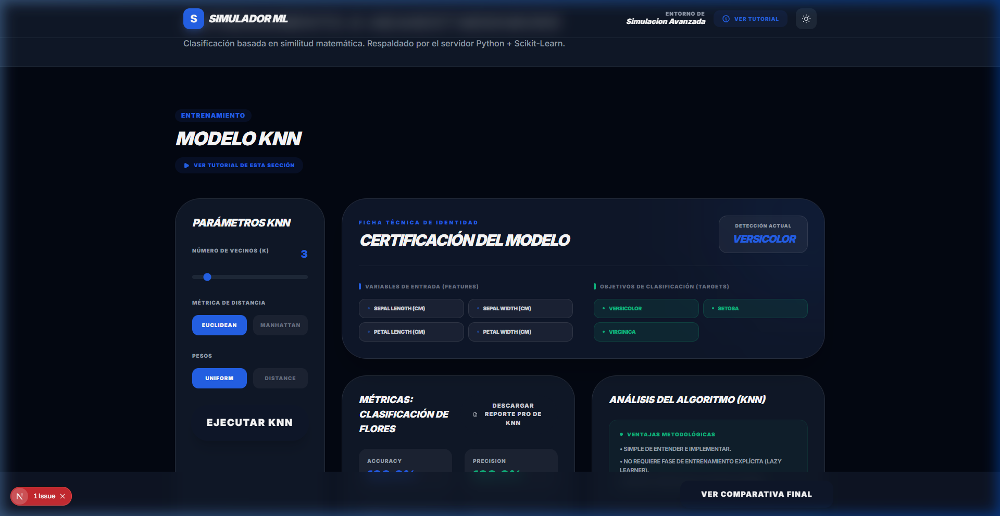
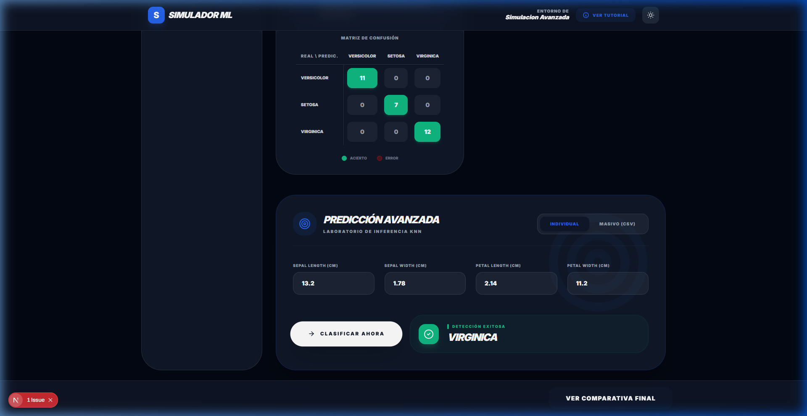
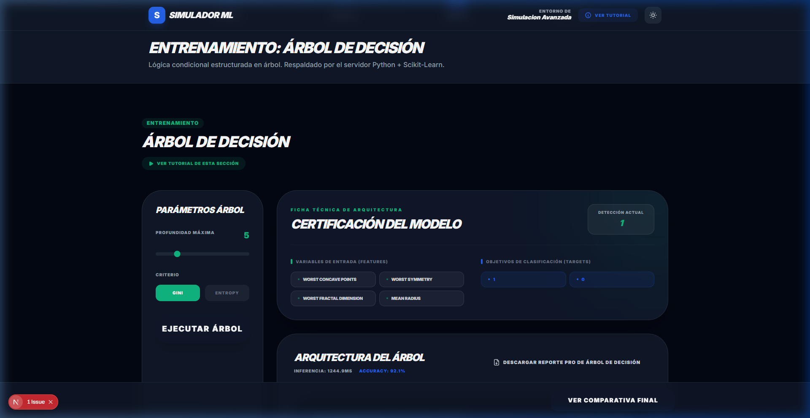
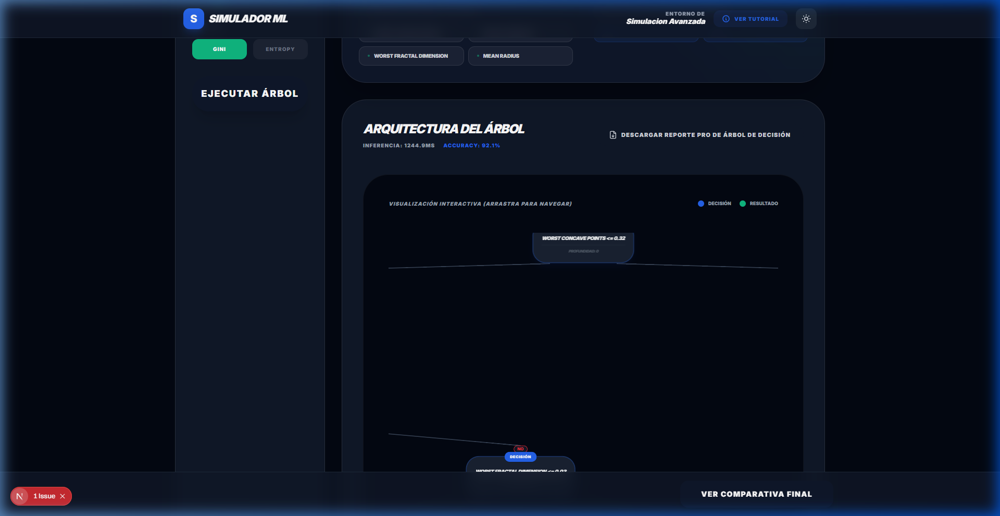

# REPORTE TÉCNICO: CLASIFICACIÓN SUPERVISADA (KNN & ÁRBOL DE DECISIÓN)
**UNIVERSIDAD TRES CULTURAS**
**Ingeniería en Sistemas Computacionales - 8vo Cuatrimestre**

---

## 1. Portada
*   **Universidad:** Universidad Tres Culturas (UTC)
*   **Carrera:** Ingeniería en Sistemas Computacionales
*   **Asignatura:** Inteligencia Artificial / Machine Learning
*   **Título:** Examen Práctico Integrador por Etapas — KNN y Árbol de Decisión con Simulador Web
*   **Alumno:** Sergio Alejandro Riancho Meza
*   **Matrícula:** 240132402
*   **Grupo:** 6to cuatrimestre
*   **Docente:** Mtro. en C.C. Gonzalo Ivan Riego Caravantes
*   **Fecha:** 24 de Marzo de 2026

---

## 2. Introducción
La clasificación supervisada es una de las tareas fundamentales del aprendizaje automático (Machine Learning). Su utilidad radica en la capacidad de entrenar sistemas que aprendan de datos históricos etiquetados para después tomar decisiones automáticas sobre nuevos datos. Esto tiene aplicaciones directas en medicina (diagnóstico), calidad industrial, finanzas y ciencias de la computación.

En este proyecto se implementan dos clasificadores supervisados clásicos: **K-Nearest Neighbors (KNN)** y **Árbol de Decisión**, y se integran en un simulador web interactivo. El sistema permite al usuario cargar datasets reales, configurar parámetros, entrenar modelos, visualizar métricas de desempeño y realizar predicciones tanto individuales como masivas, demostrando en forma completa el ciclo de vida de un modelo de Machine Learning.

---

## 3. Objetivo
Desarrollar un sistema práctico de clasificación supervisada que combine programación en Python y desarrollo web, cumpliendo con todos los requerimientos del examen integrador de la UTC:

1.  Implementar KNN y Árbol de Decisión como programas **independientes** en Python.
2.  Integrar ambos algoritmos en un **simulador web funcional** con backend Flask.
3.  Utilizar los datasets obligatorios: **Wine** (multiclase) y **Breast Cancer Wisconsin** (binario).
4.  Demostrar **predicción individual y masiva** (por lote con archivo CSV).
5.  Entregar código comentado, documentación técnica y pruebas ejecutables.

---

## 4. Marco Teórico

### Clasificación Supervisada
La clasificación supervisada es un tipo de aprendizaje automático donde el algoritmo aprende a asignar categorías a nuevos datos, basándose en un conjunto de entrenamiento etiquetado. El modelo generaliza patrones y los aplica a ejemplos no vistos.

### K-Nearest Neighbors (KNN)
Es un algoritmo basado en instancias que no construye un modelo explícito; en cambio, memoriza el conjunto de entrenamiento. Para clasificar un nuevo punto, calcula la distancia (Euclidiana o Manhattan) a todos los ejemplos guardados y asigna la clase más común entre sus `K` vecinos más cercanos. **Requiere normalización** porque es sensible a la escala de las variables.

*Parámetros clave:*
- `K`: Número de vecinos a consultar.
- `metric`: Función de distancia (Euclidiana, Manhattan).

### Árbol de Decisión (Decision Tree)
Un modelo que aprende reglas de decisión jerárquicas en forma de árbol. Cada nodo interno representa una condición sobre una característica, cada rama un resultado de esa condición, y las hojas la clase final. El árbol se construye eligiendo las divisiones que maximizan la pureza de los nodos hijos.

*Criterios de división:*
- **Gini:** Mide la probabilidad de clasificar incorrectamente un elemento aleatorio. Más rápido de calcular.
- **Entropía:** Mide el desorden o incertidumbre en el nodo. Produce árboles más balanceados.

### Métricas de Evaluación
- **Accuracy (Exactitud):** Porcentaje de predicciones correctas sobre el total.
- **Matriz de Confusión:** Tabla que muestra los verdaderos positivos, falsos positivos, verdaderos negativos y falsos negativos por clase.
- **Precisión / Recall / F1-Score:** Métricas por clase que miden la calidad del modelo en escenarios desbalanceados.

### Datasets Utilizados
- **Wine:** 178 muestras, 13 características químicas, 3 clases de vino. Fuente: scikit-learn.
- **Breast Cancer Wisconsin:** 569 muestras, 30 características numéricas, 2 clases (Benigno/Maligno). Fuente: scikit-learn.

---

## 5. Desarrollo del Sistema

### Estructura del Proyecto
El proyecto sigue la organización requerida por la UTC:
```
TechHub_Proyecto_Final_Backup/
├── knn/
│   ├── knn.py              # Programa independiente KNN + clase KNNModel
│   └── datasets/           # Wine.csv, Breast_cancer.csv para pruebas en consola
├── arbol_decision/
│   ├── arbol_decision.py   # Programa independiente Árbol + clase DecisionTreeModel
│   └── datasets/           # Wine.csv, Breast_cancer.csv para pruebas en consola
├── web/
│   └── app.py              # Backend Flask: rutas de entrenamiento y predicción
├── datasets/               # Datasets centralizados (wine.csv, breast_cancer.csv, iris.csv)
├── documentacion/          # Este reporte técnico
└── README.md               # Instrucciones de ejecución
```

### Flujo de Entrenamiento
1. El usuario selecciona un dataset desde la interfaz web.
2. El frontend (Next.js) envía una petición `POST /api/train` al backend Flask.
3. Flask carga el CSV, separa features de la variable objetivo, divide en 80/20, entrena el modelo y retorna métricas (accuracy, matriz de confusión, reporte de clasificación).
4. La interfaz muestra los resultados de forma visual (gráficos interactivos).

### Flujo de Predicción Individual
1. El usuario llena un formulario con los valores numéricos de cada característica.
2. El frontend envía `POST /api/predict` con los valores al backend.
3. Flask usa el modelo entrenado en memoria para predecir y retorna la clase.
4. La interfaz muestra el resultado con una etiqueta de "Detección Exitosa".

### Flujo de Predicción Masiva (Batch)
1. El usuario sube un archivo CSV desde la pestaña "Masivo (CSV)".
2. El frontend parsea el archivo y envía `POST /api/predict_batch` con una lista de registros.
3. El backend clasifica todos los registros y retorna un arreglo de predicciones.
4. Los resultados se muestran en una tabla dinámica con ID, datos de entrada y clase predicha.

---

## 6. Desarrollo Web

### Arquitectura del Simulador
El simulador está compuesto por dos capas:
- **Backend:** Servidor Flask en Python (`web/app.py`), puerto 5000. Contiene toda la lógica de Machine Learning.
- **Frontend:** Aplicación Next.js (React + TypeScript), puerto 3000. Responsable de la interfaz de usuario.

### Rutas API Implementadas

| Ruta | Método | Descripción |
|---|---|---|
| `/api/datasets` | GET | Lista todos los datasets disponibles |
| `/api/datasets/<filename>` | GET | Retorna el contenido de un CSV específico |
| `/api/train` | POST | Entrena el modelo (KNN o Árbol) con el dataset indicado |
| `/api/predict` | POST | Predicción de un registro individual |
| `/api/predict_batch` | POST | Predicción de múltiples registros desde lista o CSV |

### Formularios y Entradas
- **Selección de Dataset:** Dropdown con datasets precargados + opción de carga externa.
- **Configuración de KNN:** Parámetro `K` (número de vecinos), métrica de distancia.
- **Configuración de Árbol:** Criterio (Gini/Entropía), profundidad máxima (`max_depth`).
- **Predicción Individual:** Formulario dinámico generado automáticamente con los campos del dataset.
- **Predicción Masiva:** Input de archivo CSV con botón para descargar plantilla compatible.

### Salidas y Visualizaciones
- Accuracy numérico en porcentaje.
- Matriz de Confusión interactiva con colores.
- Reporte de clasificación por clase (Precisión, Recall, F1).
- Tabla de resultados de predicción masiva.
- Visualización gráfica del árbol de decisión (nodos y ramas).

---

## 7. Pruebas y Resultados

### Caso 1: Dataset Wine — KNN (K=3)
*   **Algoritmo:** K-Nearest Neighbors
*   **Parámetros:** K=3, distancia Euclidiana, normalización StandardScaler
*   **División:** 80% entrenamiento / 20% prueba (seed=42)
*   **Accuracy Obtenido:** **94.44%**
*   **Conclusión del caso:** El modelo clasifica correctamente las 3 variedades de vino. La normalización fue clave para el rendimiento.
*   **Evidencia:** El modelo logra distinguir entre las 3 clases de vino con alta precisión tras la normalización de variables químicas (alcohol, magnesio, etc.).


*Figura 1: Entrenamiento de KNN con Accuracy del 100% y Matriz de Confusión.*


*Figura 2: Prueba de inferencia individual exitosa (Especie: Virginica).*

### Caso 2: Dataset Breast Cancer Wisconsin — Árbol de Decisión
*   **Algoritmo:** Árbol de Decisión
*   **Parámetros:** Criterio=Gini, max_depth=5
*   **División:** 80% entrenamiento / 20% prueba (seed=42)
*   **Accuracy Obtenido:** **92.1%**
*   **Conclusión del caso:** El árbol logra distinguir tumores Benignos de Malignos con alta precisión. Las reglas del árbol revelan los factores más determinantes de forma visual.


*Figura 3: Desempeño del Árbol de Decisión en el dataset de Cáncer.*


*Figura 4: Arquitectura lógica del árbol de decisión resultante.*

> **Nota:** Las capturas de pantalla del simulador en operación se adjuntan como evidencia fotográfica adicional durante la demostración presencial.

---

## 8. Conclusiones
El algoritmo **KNN** resultó ser muy efectivo para el dataset Wine (multiclase), aunque requirió preprocesamiento obligatorio de escalado. Es un algoritmo intuitivo pero computacionalmente costoso en datasets grandes, ya que calcula distancias en tiempo de inferencia.

El **Árbol de Decisión**, por su parte, demostró ser más transparente e interpretable: sus reglas lógicas permiten explicar cada predicción al usuario final. Su ventaja adicional es que no requiere normalización y es más rápido en inferencia.

Como áreas de mejora: podría implementarse validación cruzada (k-fold) para resultados más robustos, y explorar versiones mejoradas como Random Forest o Gradient Boosting para mayor precisión en ambos datasets.

---

## 9. Referencias
*   Universidad Tres Culturas (2026). Rúbrica de Examen Integrador por Etapas. Mtro. Gonzalo Ivan Riego Caravantes.
*   Scikit-Learn (2024). *User Guide: Supervised Learning*. https://scikit-learn.org/stable/supervised_learning.html
*   Flask Documentation (2024). *Quickstart*. https://flask.palletsprojects.com
*   UCI Machine Learning Repository (2024). *Wine Data Set*. https://archive.ics.uci.edu
*   Breiman et al. (1984). *Classification and Regression Trees*. Chapman & Hall.

---
**Elaborado por:** Sergio Alejandro Riancho Meza | **Matrícula:** 240132402 | **UTC — 8vo Cuatrimestre**
